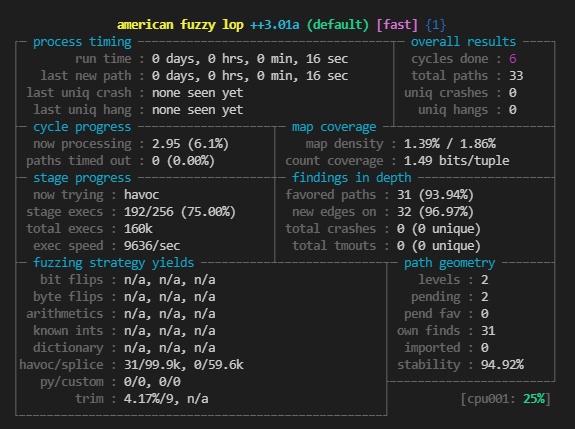

# rust fuzzing

## Setup

### Requirements

### Tools

- C compiler (e.g. gcc or clang)
- make

### Platform

* afl.rs works on x86-64 Linux and x86-64 macOS.
* libFuzzer works on x86-64 Linux, x86-64 macOS and Apple-Silicon (aarch64) macOS for now.

* `cargo install afl`
* `cargo install cargo-fuzz`

### Upgrading

* `cargo install --force afl`
* `cargo install --force cargo-fuzz`

### Provide starting inputs

Use RAMdisks for input since, we don't want to destroy harddrives

```
$sudo mount -t tmpfs -o size=1024M tmpfs in
```


### Build the fuzz target

`cargo afl build --features "fuzz" -p rspversion`

```
# for cargo fuzz:
cd spdmlib
# list all fuzz
`cargo fuzz list`
# build: replace xxx with one listed in cargo fuzz list.
`cargo fuzz build xxx`
# run
`cargo fuzz run xxx`
```

### Start fuzzing

`cargo afl fuzz -i fuzz-target/in -o fuzz-target/outrspversion target/debug/rspversion`

As soon as you run this command, you should see AFL’s interface start up:



### View the fuzz log file

`cargo afl build --features "fuzz fuzzlogfile" -p rspversion`

There are fuzz log files in the current folder traces.

### view coverage 

If you need to check coverage, follow the [coverage.md](./coverage.md) operation, Script fuzz_run.sh runs for a period fo time in each case. 
Add the coverage string after the script collects info information and generates html files. The html file location is target/debug/fuzz_coverge.
If you need to run a specific case, please modify the cmd tuple in the script.
Can run at the same time but merge will cause problems

    ```
    # Install screen 
    sudo apt install screen
    # Install expect
    sudoapt install expect
    # Run each fuzz for one hour
    bash fuzz_run.sh
    # Run each fuzz for one hour and Genarate source-based coverage report 
    bash fuzz_run.sh Scoverage
    # Run each fuzz for one hour and Genarate gcov-based coverage report 
    bash fuzz_run.sh Gcoverage

    # If thre is an error in fuzzing, please follow, and switch to the root
    user to execute the command if the error is reported.

    [-] Hmm, your system is configured to send core dump notifications to an
    external utility. This will cause issues: there will be an extended delay
    between stumbling upon a crash and having this information relayed to the
    fuzzer via the standard waitpid() API.
    If you're just testing, set 'AFL_I_DONT_CARE_ABOUT_MISSING_CRASHES=1'.

    To avoid having crashes misinterpreted as timeouts, please log in as root
    and temporarily modify /proc/sys/kernel/core_pattern, like so:

    echo core >/proc/sys/kernel/core_pattern

    [-] Whoops, your system uses on-demand CPU frequency scaling, adjusted
    between 781 and 3808 MHz. Unfortunately, the scaling algorithm in the
    kernel is imperfect and can miss the short-lived processes spawned by
    afl-fuzz. To keep things moving, run these commands as root:

    cd /sys/devices/system/cpu
    echo performance | tee cpu*/cpufreq/scaling_governor

    You can later go back to the original state by replacing 'performance'
    with 'ondemand' or 'powersave'. If you don't want to change the settings,
    set AFL_SKIP_CPUFREQ to make afl-fuzz skip this check - but expect some
    performance drop.
    ```

## Single File Data Analysis

### Analyze a piece of data to run

If you have some data to test

```
if args.len() < 2 {
    // Here you can replace the single-step debugging value in the fuzzdata array.
    let fuzzdata = [1, 26, 0, 1, 0, 0, 0, 128, 0, 0, 2, 0, 0, 4, 128, 0, 0, 2, 11, 4, 128, 0, 0, 2, 0, 246, 255, 10, 128, 0, 0, 11, 4, 0, 0, 0];
    fuzz_send_receive_spdm_version(&fuzzdata);
} 
```

`cargo  r -p package`

### Analyze the contents of a file as input

If some data is written in the file

```
let args: Vec<String> = std::env::args().collect();
if args.len() < 2 {

} else {
    let path = &args[1];
    let data = std::fs::read(path).expect("read crash file fail");
    fuzz_send_receive_spdm_version(data.as_slice());
}
```
`cargo r -p package -- file_address`


## How to debug fuzz failure.

Step1. Get the input which cause the failure.

Step2. Build an application to debug that input.

Note: If fuzzing failed in CI, crash file will be displayed in base64 encoded format. search `[encode_base64_string]` in CI log.

For example:

```
echo -n [encode_base64_string] | base64 -d > seed.raw
cargo run -p version_rsp --no-default-features -- seed.raw
```

## reference

[Rust Fuzz Book](https://rust-fuzz.github.io/book/afl/setup.html)
